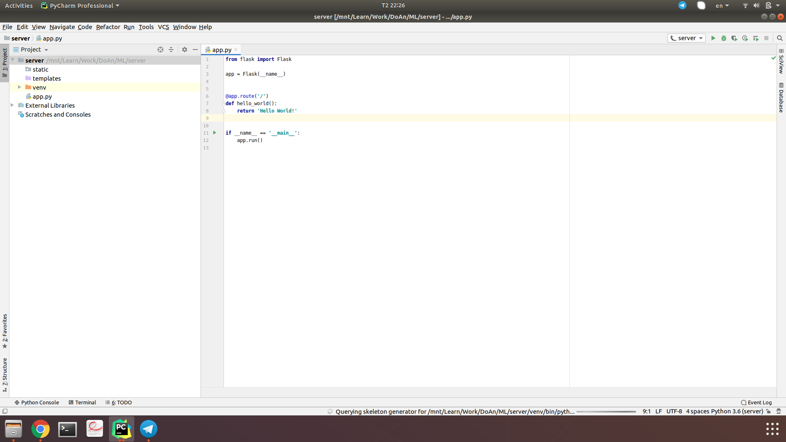

## How to build  

### 1. Tạo project mới  
* Mở Pycharm, File -> New project: 
    * Chọn Flask 
    * Chọn folder lưu trữ: Trỏ tới folder - nơi bạn muốn lưu dự án (Ở đây mình đặt tên folder là `server` và nó cũng là tên project của mình). 
    
  

    * Kết quả sau khi tạo: 


    
* Chạy thử: 
    * Sau khi tạo xong, Pycharm đã tạo sẵn một file `app.py` trong đó có sẵn 1 route có tên là: hello_world 
    * Run file này bằng cách: `Click chuột phải vào file app.py` chọn `Run` hoặc dùng tổ hợp phím: `Shift + F10` nếu chúng ta đang ở trong file `app.py` 
    * Sau khi chạy chúng ta sẽ có được kết quả giống như thế này: 

> Output khi run 

```text
FLASK_APP = app.py
FLASK_ENV = development
FLASK_DEBUG = 0
In folder /mnt/Learn/Work/DoAn/ML/server
/mnt/Learn/Work/DoAn/ML/server/venv/bin/python -m flask run
 * Serving Flask app "app.py"
 * Environment: development
 * Debug mode: off
 * Running on http://127.0.0.1:5000/ (Press CTRL+C to quit)
127.0.0.1 - - [02/Dec/2019 22:37:51] "GET / HTTP/1.1" 200 -
```    

> Ảnh màn hình chrome + Console  

`Muốn xem được output trên chrome, chúng ta phải đợi cửa sổ console xuất hiện dòng chữ: * Running on http://127.0.0.1:5000/ (Press CTRL+C to quit)`

 

### 2. Install các thư viện cần thiết để chạy project tensorflow-for-poet-2  

* Chúng ta vào `File` -> `Settings` -> `Project: ...` -> `Project interpreter` hoặc có thể dùng tổ hợp phím tắt: `Ctrl Alt + S`    
    * Màn hình `Settings` mở ra sẽ có dạng như thế này:  
   
 

* Thẳng hàng `Package`, `Version`, `Latest version` có dấu `+`, chuột trái vào dấu `+` này:
    * Màn hình `Available Packages` hiện ra, chúng ta nhập `tensorflow` vào 
    * Chọn `tensorflow`, Tích vào ô ở góc phải bên dưới của cửa sổ này có chữ `Specify version`
    * Chọn `Specify version` là `1.14.0` (Version bắt buộc nếu không muốn lỗi)  
    * Nhấn vào button `Install Package` ở góc dưới cùng - bên trái của cửa sổ.
    
 

* Sau khi cài đặt thư viện `tensorflow` version `1.14.0` chúng ta sẽ có tất cả những thư viện sau đây: 

 

### 3. Thêm các package cần thiết để realtime predictions 

* Clone project này về: 

    * Đi tới thư mục hoặc tạo một folder - nơi chúng ta muốn chứa project khi clone về: (Không nên để vào folder server - thư mục chứa project chúng ta vừa tạo)
    * Chuột phải vào folder vừa tạo (hoặc nơi muốn chứa) chọn: `Open in Terminal` 
    * Trên `Terminal` vừa hiện ra chúng ta chạy lệnh sau:  
```shell script
git clone https://github.com/ur4nium235/server.git
```  


* Sau khi clone về, vào thư mục vừa clone (tên thư mục của mình là flask-server), `copy cả thư mục script`: 
    * Sau đó paste vào project `server` vừa tạo (sau khi paste vào, thư mục cha của thư mục `scripts` là thư mục `server`) 
    
  

* Đến đây, chúng ta copy đoạn code dưới đây và dán lại vào file `app.py` (Code cũ trong file này xóa hết đi nhé)  

```python
import os
from flask import Flask, flash, request, redirect, url_for, jsonify
from scripts import label_image

app = Flask(__name__)

@app.route('/')
def hello_world():
    return '<h2>Image classifier!</h2>'

@app.route('/prediction', methods=['POST', 'GET'])
def prediction():
    if request.method == "GET":
        return  '<h2>Real-time predictions</h2>'

    data = request.json
    print("data", data)

    pathToImagePrediction = data.get('path')

    if checkingIfFileExists(pathToImagePrediction) == False:
        return jsonify("File not found!")
    else:
        return jsonify(label_image.prediction(pathToImagePrediction))

def checkingIfFileExists(pathToFile) :
    return os.path.isfile(pathToFile)

if __name__ == '__main__':
    app.run()

```

* Sau đó chạy file `app.py` này chúng ta được màn hình `console` với một đống cảnh bảo và xem kết quả trên chrome `127.0.0.1:5000` giống như sau: 

  

> Lỗi cảnh báo này sẽ fix ở đoạn sau cùng  


* Lúc này, chúng ta còn thiếu thưc mục `tf_files` chứa file `retrained_graph.pb` và file `retrained_labels.txt`:
    * Trên project ở `Pycharm`, tạo thưc mục có tên `tf_files` (thưc mục cha của thư mục `tf-files` là thư mục `server`) 
    * Copy file `retrained_graph.pb` và `retrained_labels.txt` vào thư mục `tf_files`
    * Nếu chưa có 2 file này, có thể [download tại đây](https://drive.google.com/file/d/14nZDVaJqcZZ69MMFeSYPd1ErFxF4zipC/view?usp=sharing)   

* Tiếp theo, hãy mở `Postman` để tạo các request giống như cách client gửi request cho chúng ta bằng cách: 
    * Ấn phím `window` - phím cửa sổ rồi nhập `Postman` -> `Enter` 
    
  

* Khi `Postman` được khởi động nó yêu cầu một số thứ, chúng ta `cancel` hoặc `x` hết. 
    * Sau khi `Postman` được mở, tạo request `POST` giống như sau:  
    
```text
Method: POST 
Request UTL: 127.0.0.1:5000/prediction

# Body: 
raw 
JSON (application/json)  

{
	"id": 123,
	"path": "/mnt/Learn/Work/DoAn/ML/flask_server/tf_files/apple.jpg"
} 

Trong đó: 
+ "id": có thể có hoặc không 
+ "path": đường dẫn đến ảnh cần dự đoán nhẵn, nếu không có, server sẽ trả về File not found! 
```  

`Chúng ta tạo request giống như trong ảnh` 
    
   

* Lúc này, run lại file `app.py`  
    * Vào `Postman` ấn `Send`
    * Kết quả: `"apple (score=95.51)"`  
    
   

### Fix lỗi thư viện tensorflow 

* Trên `Pycharm` vào thư mục `venv`:  
    * tiếp tục truy cập `lib` -> `python3.6` -> `site-packages` -> `tensorflow` -> `python` -> `framework` -> `dtypes.py`  
    * Sau khi mở file `dtypes.py`, tìm đoạn comment sau `_np_bfloat16 is defined by a module import`  
    
  

> Chúng ta sẽ nhìn thấy đoạn code sau từ dòng 516 đến dòng 525: 

```python
_np_qint8 = np.dtype([("qint8", np.int8, 1)])
_np_quint8 = np.dtype([("quint8", np.uint8, 1)])
_np_qint16 = np.dtype([("qint16", np.int16, 1)])
_np_quint16 = np.dtype([("quint16", np.uint16, 1)])
_np_qint32 = np.dtype([("qint32", np.int32, 1)])

# _np_bfloat16 is defined by a module import.

# Custom struct dtype for directly-fed ResourceHandles of supported type(s).
np_resource = np.dtype([("resource", np.ubyte, 1)])
```        
**Thay nó bằng đoạn code sau:**  

```python
_np_qint8 = np.dtype([("qint8", np.int8, (1,))])
_np_quint8 = np.dtype([("quint8", np.uint8, (1,))])
_np_qint16 = np.dtype([("qint16", np.int16, (1,))])
_np_quint16 = np.dtype([("quint16", np.uint16, (1,))])
_np_qint32 = np.dtype([("qint32", np.int32, (1,))])

# _np_bfloat16 is defined by a module import.

# Custom struct dtype for directly-fed ResourceHandles of supported type(s).
np_resource = np.dtype([("resource", np.ubyte, (1,))])
```

  

* Tương tự như vậy,
    * tiếp tục truy cập `lib` -> `python3.6` -> `site-packages` -> `tensorboard` -> `compat` -> `tensorflow_stub` -> `dtypes.py`  
    * Sau khi mở file `dtypes.py`, tìm đoạn comment sau `_np_bfloat16 is defined by a module import`  

> Chúng ta sẽ nhìn thấy đoạn code sau từ dòng 541 đến dòng 550: 

```python
_np_qint8 = np.dtype([("qint8", np.int8, 1)])
_np_quint8 = np.dtype([("quint8", np.uint8, 1)])
_np_qint16 = np.dtype([("qint16", np.int16, 1)])
_np_quint16 = np.dtype([("quint16", np.uint16, 1)])
_np_qint32 = np.dtype([("qint32", np.int32, 1)])

# _np_bfloat16 is defined by a module import.

# Custom struct dtype for directly-fed ResourceHandles of supported type(s).
np_resource = np.dtype([("resource", np.ubyte, 1)])
```        
**Thay nó bằng đoạn code sau:**  

```python
_np_qint8 = np.dtype([("qint8", np.int8, (1,))])
_np_quint8 = np.dtype([("quint8", np.uint8, (1,))])
_np_qint16 = np.dtype([("qint16", np.int16, (1,))])
_np_quint16 = np.dtype([("quint16", np.uint16, (1,))])
_np_qint32 = np.dtype([("qint32", np.int32, (1,))])

# _np_bfloat16 is defined by a module import.

# Custom struct dtype for directly-fed ResourceHandles of supported type(s).
np_resource = np.dtype([("resource", np.ubyte, (1,))])
```

`Đến lúc này, chúng ta đã fix xong lõi, run lại project thôi nào!!!`  

* Run file `app.py`  
* Đợi nó hiện chữ: 

```text
* Running on http://127.0.0.1:5000/ (Press CTRL+C to quit)
``` 

* Quay lại `Postman` và gửi lại request, kết quả: 

  


### Fix result label_image 

> Chúng ta có thể định dạng đầu ra theo ý muốn trong file scripts/label_image.py   

**Chỉ lấy 1 label trả về**  

* Trong file `scripts/label_image.py` tìm đoạn code   

```python
```python
  top_k = results.argsort()[-5:][::-1]
  labels = load_labels(label_file)

  # print('\nEvaluation time (1-image): {:.3f}s\n'.format(end-start))
  template = "{} (score={:2.2f})"
  # for i in top_k:
  #   print(template.format(labels[i], results[i]))


  result = template.format(labels[top_k[0]], 100*results[top_k[0]])
```  

* Sửa:  

`Thay đoạn này trong file code trên`  

```python
result = template.format(labels[top_k[0]], 100*results[top_k[0]])
```

`Thành đoạn code này:`  

```python
result = labels[top_k[0]]
```  

> Như vậy đã sửa xong phần 1 lấy ra 1 nhãn, để có thể hiểu chi tiết hơn, chúng ta sẽ đá qua phần xử lý để hiểu rõ hơn 


**Quay lại một chút về phần xử lý**

> Lấy k phần tử lớn nhất của mảng theo index     

* `arr = [1.48,1.41,0.0,0.1]`: mảng các phần tử ban đầu 
  * index = [0, 1, 2, 3]: mảng các index ban đầu của `arr`
* `arr.argsort()`: trả về chỉ mục của array được sắp xếp tăng dần (phần tử cuối cùng là phần tử lớn nhất, phần tử đầu tiên là phần tử nhỏ nhất) 
  * Thứ tự index sau khi dùng `argsort`: `arr_index_sort_asc = arr.argsort() = [2, 3, 1, 0]`
* `arr_index_sort_asc[-k:]` : lấy k giá trị cuối cùng của mảng
  * `sub_arr_index_sort_asc = arr_index_sort_asc[-2:] = [1, 0]`  
* `sub_arr_index_sort_asc[::-1]`: đảo ngược kết quả của mảng 
  * `top_k = sub_arr_index_sort_asc[::-1] = [0, 1]`
* Viết ngắn gọn: `top_k = arr.argsort()[-2:][::-1] = [0, 1]`

* Dòng 108 file `label_image.py` có đoạn: 

```python
template = "{} (score={:2.2f})"
```  
> Định nghĩa output khi trả về, gồm 1 label, và 1 số kiểu double (lấy 2 số trước dấu phẩy và 2 số sau dấu phẩy)  

Ví dụ: `"apple (score=95.51)"` 

#### Good luck  


